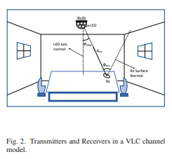

# Resource Optimization in Visible Light Communication for Internet of Things

## Optimization Problem:

**Objective:** Minimize the total consumed energy emitted by each LED.

### Constraints:

- **LEDs’ Power Budget:** Each LED has a maximum power limit.
- **Users’ Perceived Quality-of-Service:** Maintain effective data transmission quality.
- **LED-User Associations:** Properly associate each LED with at most one user.
- **Illumination Uniformity Constraints:** Ensure uniform lighting throughout the area.

### Solution Approach:

- **Stage 1: LED-User Association for Fixed LED Powers:**\
   Design an efficient algorithm to associate users with LEDs, assuming the power of each LED is fixed.

- **Stage 2: Power Optimization using LED-User Association:**\
  Using the established LED-user association, optimize the power levels of the LEDs. This involves finding an approximate solution using the Taylor series to balance energy consumption and constraints.

## System Model:

- **The bulb is a hemispherical structure with multiple LEDs to cover different parts of the room, serving as both a light source and a wireless access point:**

  > This structure aligns with the optimization problem's focus on ensuring illumination uniformity and effective LED-user associations to provide both lighting and data transmission.

- **The system consists of 𝑀 LEDs and 𝑈 users, with each LED emitting power
  𝑃𝑚
  Watts. Users are equipped with photo-detectors (PDs) to receive data from LEDs.**

  > This setup directly relates to the LEDs’ power budget constraint and the users’ perceived quality-of-service (QoS) constraint, as each LED’s power needs to be optimized for efficient data transmission and adequate lighting.

- **LEDs provide dual functionality: illumination and wireless data download to mobile users. Each LED acts as a transmitter, facilitating simultaneous downloads to multiple users:**
  > This dual functionality is central to the optimization problem, which aims to minimize total energy consumption while maintaining both lighting and communication efficiency.

### Assumptions:

- Inside the room, each mobile user can have one PD
  receiver and one RF transmitter, and this user is able to
  extricate the desired signal from the optical transmitters.
- Locations of the mobile users are known.
- There are N fixed sensors uniformly distributed inside
  the room. These are not equipped with decoders and are
  only used for measuring the illumination uniformity in
  the room. The light intensity received at these sensors
  determine how uniform the lighting is inside the room. It
  is possible to place these sensors at a place of interest,
  however, we assume that they are uniformly distributed, in a lattice placement pattern, to the room floor.

- **LED-User Association:**\
   A binary variable ϵ
  mu that indicates the
  association between LED m and user u which is given as
  follows:
     

     
     
     

  we assume that user u can be associated to many
  LEDs at the same time. In contrary, an LED is not allowed to
  associate with more than one user simultaneously

  - **Channel Model:**
    

     
     
     

- **Signal-to-Interference and Noise Ratio (SINR) Calculation:**
  

    
  

- **Illumination Uniformity:**

   
 

## Problem Formulation:

We formulate an optimization problem aiming to minimize
the total energy consumption of LEDs while satisfying a certain
rate threshold for users and taking into consideration the
association and illumination uniformity constraints. So, the
optimization problem can be written as:

    

**where:**

- _(2) and (8)_ represent the LEDs’ power budget and association constraints.
- (9) represents the illumination uniformity
  constraint.\
  Imin is defined as the minimum acceptable illumination uniformity threshold which we set to be 0.7.
- (10) represents the minimum rate QoS, where R is
  the minimum rate expected for each IoT device.

## Problem Solution:

The formulated optimization problem given in (7)-(10)
is a non-convex and mixed-integer non-linear programming
problem. So, we propose a low complexity two stages solution.\
**P0:** In the first stage, we propose a ’Nearest User
Assignment’ approach to determine the value of ϵ
mu .\
**P1:** given the LED-user associations, we optimize the LEDs’ power
allocations in the second stage.

Optimizing ϵ mu and Pm
really complex specially for IoT scenarios where we have large number of users U and large number of LEDs M.

In a practical scenario, IoT devices or users will be moving in the room and every time users’ locations change the optimization will need to be re-performed.\
Therefore, a Two-Stage Solution (TSS) as a practical and efficient solution with less complexity is used.

### 1) LED-User Association:

---

> ### Nearest User Assignment Approach
>
> #### Purpose:
>
> To efficiently assign each LED to the nearest user, ensuring optimal alignment for data transmission.
>
> #### Steps:
>
> 1. **Identify Light Cone of Each LED:**
>    - Determine the light cone region for each LED.
> 2. **Determine User Coordinates:**
>    - Obtain the positions of all users in the room.
> 3. **Calculate Proximity:**
>    - For each LED \( m \), compute the distance to each user’s position.
> 4. **Assign Nearest User:**
>    - Find the user \( u \) closest to the LED’s light cone center.
>    - Set \( ϵmu = 1 \) for the nearest user and \( ϵmu' = 0 \) for all other users.
> 5. **Ensure Exclusive Assignment:**
>    - Ensure each LED is assigned to only one user at a time.
> 6. **Use Association Matrix:**
>    - Use the resulting LED-User association matrix \( ϵmu \) for further optimization.

    

### 2) Power Optimization:

---

For given LED-user association, the optimization problem **P0** that optimizes LEDs’ power can be written as:

    

the objective function is a convex function
and all constraints are convex functions except (10). This constraint is neither concave nor convex with respect to the LED
transmit power Pm . Hence, the goal is to convert constraint (10)
into a convex one in order to solve the problem efficiently.
Therefore, constraint (10) can be re-written as:

    
    

It can be seen that the RHS of (12)
is a linear function, thus we only need to approximate the
LHS. Therefore, we propose to use same first order Taylor expansion approximation in order to convert the LHS of (12)
into a convex one as the following:

    
    

After the approximation,
the optimization problem **P1** becomes a convex optimization
problem and it can be solved using standard convex optimization techniques.\
Finally, we propose to use Successive
Convex Approximation (SCA) approach
to find the best Taylor series approximation.

> **Successive Convex Approximation (SCA):** \
> **Purpose:**\
> To iteratively solve a non-convex optimization problem by approximating it with convex sub-problems, which are easier to solve.
>
> **Steps Involved in SCA:**
>
> **Initial Problem Setup:**
>
> - Start with a non-convex optimization problem that needs to be solved.
> - Example: Minimizing LED power while ensuring QoS and illumination constraints.
>
> **Approximate the Problem:**
>
> - Use a Taylor series or other approximation methods to linearize or convexify the non-convex parts of the problem.
> - This transforms the original problem into a convex sub-problem that can be solved more easily.
>
> **Solve the Convex Sub-Problem:**
>
> - Solve the approximated convex problem using standard convex optimization techniques.
> - Obtain a solution that is optimal for the convexified problem.
>
> **Update and Iterate:**
>
> - Update the variables based on the solution obtained.
> - Use this solution as the starting point for the next iteration.
> - Re-approximate the original problem around the new solution, creating a new convex sub-problem.
>
> **Convergence Check:**
>
> - Check if the solution has converged, i.e., if the changes in objective value or variables are below a predefined threshold.
> - If not, repeat the approximation and solving steps until convergence is achieved.
>
> **Final Solution:**
>
> - The final solution is an approximation to the original non-convex problem, obtained after several iterations.

## Algorithm used:

    

### Algorithm explanation:

---

### Algorithm 1: Algorithm for TSS

#### **Initialization:**

1. **Set Initial Association Matrix:**

   - Initialize ϵmu = 0 for all \( m \) and \( u \).

2. **Initialize Variables:**
   - Set d to 0 : A variable to hold the distance between the center of the light cone and the user.
   - Set dmin to ∞ : A variable to keep track of the minimum distance found..
   - Set 𝑛 to 0: A variable to identify the index of the nearest user.

#### **Nearest User Assignment:**

3. **Iterate Over Each LED:**

   - For each LED 𝑚 from 1 to 𝑀

4. **Iterate Over Each User:**

   - For u from 1 to U.

5. **Check User Inside Light Cone:**

   - If user u is inside the cone of LED m.

6. **First Distance Calculation:**

   - If \( d = 0 \):
     - Calculate 𝑑 as the distance between the center of the cone and the user 𝑢.
     - Set \( dmin = d \).
     - Set \( n = u \) : Set 𝑛 to the current user’s index.

7. **Subsequent Distance Calculations:**

   - If \( d != 0 \):
     - Calculate \( d \).
     - If \( d < dmin \):
       - Update \( dmin\).
       - Update \( n \).

8. **End User Loop:**

9. **Assign Nearest User:**
   - If \( n != 0 \):
     - Set \( ϵmu = 1 \).

#### **Power Optimization:**

10. **Initial Power Values:**

    - Select initial power values \( Pm \).

11. **Repeat Optimization Steps.**

12. **Optimization Iteration:**

    - Set \( r = 1 \) : Initialize the iteration counter..

13. **Solve Optimization Problem:**

    - Solve with \( ϵmu \) using the interior-point method to find \( Pm \).

14. **Check for Convergence:** - Until \( |x(r+1) - x(r)| <= 𝜉 \).\
    (where
    𝜉 is a small threshold) is met.

## Simulation Results:

    

#### Room and Bulb Configuration:

1. **Room Dimensions:**

   - 6 m × 6 m floor, 3 m height.
   - Tests illumination uniformity and LED-user associations.

2. **Hemispherical Bulb:**
   - 40 cm radius, 65 LEDs in 6 layers plus 1 central LED.
   - Supports spatial reuse and data transmission efficiency.

#### LED and Receiver Specifications:

3. **LED and Photo-Detector Dimensions:**
   - LED radius \( rt = 1.5 \) cm, PD radius \( rr = 3.75 \) cm.
   - Key for light cone and proximity calculations in Nearest User Assignment.

#### Bandwidth and Performance Targets:

4. **Bandwidth:**

   - 20 MHz bandwidth.
   - Affects communication efficiency constraint.

5. **Target Illumination and Data Rate:**
   - Minimum uniformity \( I min = 0.7 \), minimum rate \( R u = 1 \) Mbps.
   - Directly tied to illumination and QoS constraints.

#### Simulation Parameters:

6. **Random User Locations:**

   - 100 runs with random locations.
   - Tests robustness of TSS and power optimization.

7. **Random Number Seeding:**
   - Prime numbers starting with 11.
   - Ensures reproducibility and randomness.

#### Performance Evaluation:

8. **Confidence Intervals:**
   - 95% confidence intervals.
   - Provides reliability and accuracy in evaluating TSS effectiveness.

### 1) Effect on Total Power Consumption of the System:

---

#### Overview:

- **Objective Function:** Minimize total power consumption.
- **Observation:** Total power consumption rises with more users, but remains controlled.

#### Key Points:

1. **Total Power Consumption:**

   - The system’s total power consumption increases with more users.
   - Maintains minimum data rate and illumination uniformity constraints.

2. **Average Transmit Power Per User:**

   - The average transmit power per user decreases as the number of users increases.
   - When fewer users are present, more LEDs are available per user, leading to higher power allocation per user. With more users, LEDs are shared, reducing per-user power.

3. **LED-User Association Adjustment:**

   - The LED-user associations adjust to maintain the required QoS and illumination as user numbers grow.

   - This reflects the algorithm’s effectiveness in dynamically optimizing LED-user associations and power allocation to meet constraints.

#### Observation:

1. **Power Decay Analysis:**

   - Comparison of power decay per user with increasing users, using
     1/U function for divergence angles θd = 20 and 80 deg.

   - Shows wider angles lead to slower power decay due to higher interference, requiring higher transmit power.

2. **Interference and Divergence Angle:**
   - Wider divergence angles cause more interference, needing more transmit power to maintain Signal-to-Interference-plus-Noise Ratio (SINR).
   - Demonstrates the trade-off between beam width and power efficiency, highlighting the importance of optimizing divergence angles.

    

### 2) Effect on Data Rate:

---

#### Key Points:

- Ensure a minimum data rate to maintain Quality of Service (QoS) for all users, as the number of users increases.

#### Observation:

- The minimum data rate decreases as the number of users increases but remains within acceptable limits.
- This aligns with the minimum rate QoS constraint, ensuring each user receives the required data rate despite user density changes.

#### Trade-Offs and Divergence Angles:

1. **Divergence Angle Impact:**

   - **Observation:** Wider angles offer higher rates for fewer users but struggle with more users.
   - **Relation:** Highlights trade-off between interference management and data rate, crucial for LED-user associations and power allocations.

2. **Narrower Divergence Angles:**
   - Narrower angles provide lower initial data rates but better maintain them with increasing users.

    

### 3) System Analysis for different LED Divergence Angles:

---

#### Overview:

- Examine the impact of LED divergence angles on total power consumption, and minimum and average data rates.
- **Parameters:** Analysis for U=5,10,20 users and divergence angles θd = 20 to 120 step 10.

#### Observation:

1. **Total Power Consumption:**

   - Less power needed beyond θd = 60.
   - Wider angles enhance power efficiency, aligning with LEDs’ power budget constraint.

2. **Minimum Data Rate:**

   - Wider angles, beyond θd = 60, generally support the minimum data rate required for users.
   - This supports the minimum rate QoS constraint, ensuring each user meets the required data rate.

3. **Average Data Rate:**

   - Increases significantly with angles more than 40 deg., peaking around 70 deg..

4. **Optimal Range for Divergence Angles:**
   - Best performance between 60 and 90 deg.
   - This range provides a balance between maintaining data rates and managing power consumption, optimizing LED-user associations and power allocations.

    

